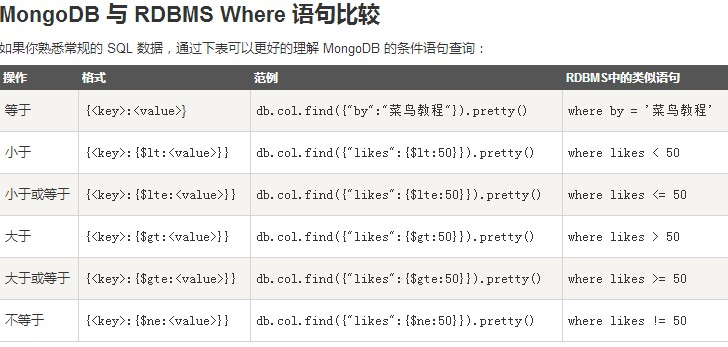

基本操作
========
通过cmd输入命令链接上mongoDB后，可以打开mongodb装目录的下的bin目录，然后执行mongo.exe文件。

或者再开一个cmd，进入bin目录，输入mongo命令打开shell，其实这个shell就是mongodb的客户端，同时也是一个js的编译器，默认连接的是“test”数据库。

1.创建/删除数据库
------------------
命令：
::
 > use 数据库名
如果数据库不存在，则创建数据库，否则切换到指定数据库。
::
 > db
查看当前数据库。
::
 > show dbs
查看所有数据库。

我们刚创建的新数据库并不在查看出来的所有数据库的列表中， 要显示它，我们需要向新建的数据库插入一些数据。
::
 > db.dropDatabase()
删除当前数据库
::
 > db.集合名.drop()
删除集合

2.插入文档
----------
文档的数据结构和JSON基本一样。所有存储在集合中的数据都是BSON格式。BSON是一种类json的一种二进制形式的存储格式,简称Binary JSON。

MongoDB 没有像 SQL 一样有自动增长的功能， MongoDB 的 _id 是系统自动生成的12字节唯一标识。

MongoDB 使用 insert() 或 save() 方法向集合中插入文档，语法如下：
::
 > db.集合名.insert(文档)
实例
::
 > db.person.insert({name:”lishuang”,age:”你猜”})
person是集合名，如果该集数据库中没有person集合， MongoDB 会自动创建该集合并插入文档。
::
 > db.person.find()
查询集合

插入文档你也可以使用 db. person.save(document) 命令。如果不指定_id字段save()方法类似于insert()方法。如果指定_id字段，save()则会更新该 _id 的数据。

db.collection.insertOne():向指定集合中插入一条文档数据

db.collection.insertMany():向指定集合中插入多条文档数据

3.更新文档
----------
update() 方法用于更新已存在的文档。
::
 >  db.collection.update(
   <query>,
   <update>,
   {
     upsert: <boolean>,
     multi: <boolean>,
     writeConcern: <document>
   }
 )
参数说明：
 * query : update的查询条件，类似sql update查询内where后面的。
 * update : update的对象和一些更新的操作符（如$,$inc...）等，也可以理解为sql update查询内set后面的
 * upsert : 可选，这个参数的意思是，如果不存在update的记录，是否插入objNew,true为插入，默认是false，不插入。
 * multi : 可选，mongodb 默认是false,只更新找到的第一条记录，如果这个参数为true,就把按条件查出来多条记录全部更新。
 * writeConcern :可选，抛出异常的级别。
实例
::
 db.person.update({age:”你猜”},{$set:{age:23}},{multi:true})
设置 multi 参数为 true是要修改多条相同的文档。
::
 db.person.find()
save() 方法通过传入的文档来替换已有文档

save() 方法的格式就是正常插入文档，与insert()方法相同，如果文档已存在则更新文档，如果不存在则插入文档。

4.删除文档
----------
命令：
::
 db.collection.remove(
   <query>,
   {
     justOne: <boolean>,
     writeConcern: <document>
   }
 )
参数说明：
 * query :（可选）删除的文档的条件。
 * justOne : （可选）如果设为 true 或 1，则只删除一个文档。
 * writeConcern :（可选）抛出异常的级别。
实例
::
 db.person.remove({age:23})
命令：
::
 db.person.remove({})
删除所有

5.查询
------
普通查询
++++++++
::
 db.person.find(query,projection)
 * query ：可选，使用查询操作符指定查询条件
 * projection ：可选，使用投影操作符指定返回的键。查询时返回文档中所有键值， 只需省略该参数即可（默认省略）_id是默认显示的，也可以手动设为0（不显示）。
实例
::
 db.person.find({age:23},{age:1})
对应SQL:
::
 select id,age from person where age = 23 
命令:
::
 db.person.find().pretty()
pretty() 方法以格式化的方式来显示所有文档。

MongoDB与RDBMS Where语句比较
++++++++++++++++++++++++++++

And条件
+++++++
查找年龄大于20小于30的人
::
 db.person.find({$and:[age:{$gt:20},{age:{$lt:30}}]})
对应SQL：
::
 select * from person where age between 20 and 30
还有许多查询运算符比如$or,$in,$type……等等。
::
 db.person.find().limit(NUMBER)
limit(NUMBER)方法返回结果的记录条数
::
 db.person.find().limit(NUMBER).skip(NUMBER)
skip(NUMBER)方法来跳过指定数量的数据