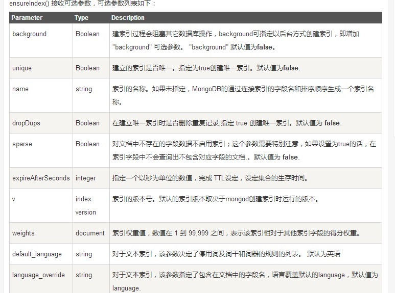
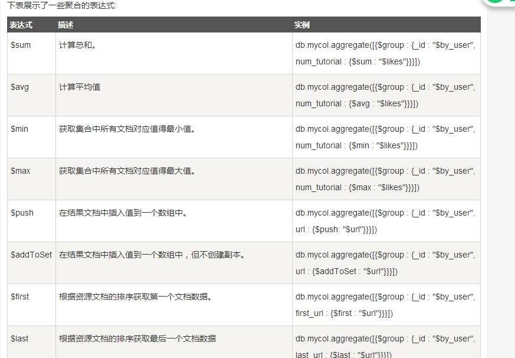

排序、索引、聚合
================
排序
----
命令：
::
 db.person.find().sort({KEY:1})
在MongoDB中使用使用sort()方法对数据进行排序，sort()方法可以通过参数指定排序的字段，并使用 1 和 -1 来指定排序的方式，其中 1 为升序排列，而-1是用于降序排列。

索引
----
命令
::
 db.person.ensureIndex({KEY:1})
语法中 Key值为你要创建的索引字段，1为指定按升序创建索引，如果你想按降序来创建索引指定为-1即可。

ensureIndex() 方法中你也可以设置使用多个字段创建索引（关系型数据库中称作复合索引）

命令：
::
 db.person.find({age:23}).explain()
explain 操作提供了查询信息，使用索引及查询统计等。有利于我们对索引的优化。

也可以使用 hint 来强制 MongoDB 使用一个指定的索引。(我已经创建了age索引)
::
 db.person.find({age:23}).hint({age:1}).explain()
 
索引数组字段
++++++++++++
需要对集合中的数组字段建立索引。在数组中创建索引，需要对数组中的每个字段依次建立索引。

索引子文档字段
++++++++++++++
字段是子文档的字段，所以我们需要对子文档建立索引。为子文档的三个字段创建索引

索引限制
++++++++
1. 每个索引占据一定的存储空间，在进行插入，更新和删除操作时也需要对索引进行操作。所以，如果你很少对集合进行读取操作，建议不使用索引。

2. 由于索引是存储在内存(RAM)中,你应该确保该索引的大小不超过内存的限制。如果索引的大小大于内存的限制，MongoDB会删除一些索引，这将导致性能下降。

3. 索引不能被以下的查询使用：
 正则表达式及非操作符，如 $nin, $not, 等。
 
 算术运算符，如 $mod, 等。
 
 $where 子句。
 
 所以，检测你的语句是否使用索引是一个好的习惯，可以用explain来查看。
4. 如果现有的索引字段的值超过索引键的限制，MongoDB中不会创建索引。

5. 如果文档的索引字段值超过了索引键的限制，MongoDB不会将任何文档转换成索引的集合。与mongorestore和mongoimport工具类似。

6. 集合中索引不能超过64个

 索引名的长度不能超过128个字符

 一个复合索引最多可以有31个字段

聚合
----
MongoDB中聚合(aggregate)主要用于处理数据(诸如统计平均值,求和等)，并返回计算后的数据结果。有点类似sql语句中的 count(*)。
::
 db.person.aggregate(OPERATION)

MongoDB的聚合管道将MongoDB文档在一个管道处理完毕后将结果传递给下一个管道处理。管道操作是可以重复的。

表达式：处理输入文档并输出。表达式是无状态的，只能用于计算当前聚合管道的文档，不能处理其它的文档。

介绍一下聚合框架中常用的几个操作：
 * $project：修改输入文档的结构。可以用来重命名、增加或删除域，也可以用于创建计算结果以及嵌套文档。
 * $match：用于过滤数据，只输出符合条件的文档。$match使用MongoDB的标准查询操作。
 * $limit：用来限制MongoDB聚合管道返回的文档数。
 * $skip：在聚合管道中跳过指定数量的文档，并返回余下的文档。
 * $unwind：将文档中的某一个数组类型字段拆分成多条，每条包含数组中的一个值。
 * $group：将集合中的文档分组，可用于统计结果。
 * $sort：将输入文档排序后输出。
 * $geoNear：输出接近某一地理位置的有序文档。
命令： 
::
 db.person.aggregate(
    { $project : {
        age : 1 ,
        name : 1 ,
    }}
 );
查询age和name
::
 db.articles.aggregate( [
                        { $match : { age : { $gt : 20, $lte : 30 } } },
                        { $group: { _id: null, count: { $sum: 1 } } }
                       ] );
$match用于获取年龄大于20小于或等于30记录，然后将符合条件的记录送到下一阶段$group管道操作符进行处理。