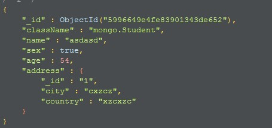
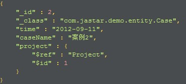
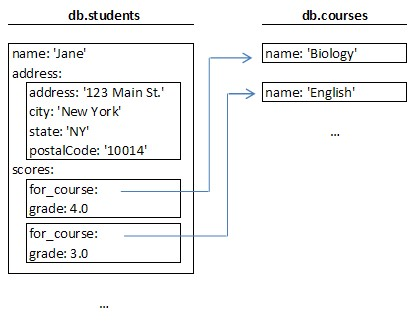
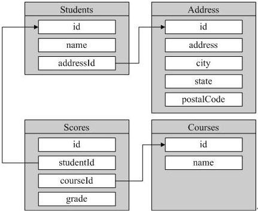

引用和嵌入
==========

图一

图二

图一为嵌入，将address集合嵌入一个集合中
图二为引用(ref)，$ref为被引用的集合名，$id为id

我们有两个Collection，student和coureses。第一张图就是MongoDB表设计，学生Collection中包含一个嵌入的address文档和coursesCollection有引用关系的score文档。第二张图为关系型数据库的建表模式。

关系型与mongoDB比较
-------------------
student与score是一对多的关系，其scores字段就是一个BSON，该BSON可以只有一个for_course，也可以有两个、三个、任意个for_course，其固有的模式自由特性使得它可以将score包含在内而无需另建一个score集合。

对于与student为一对一关系的address表也可以直接合入student，无需担心address的扩展性，当以后需要给address新增一个province字段，直接在数据插入时加上这个值即可。

对于与student成多对多关系course表，为了减少数据冗余，可以将course建立为一个集合，同关系型的数据库设计中类似。

mongoDB嵌入与引用比较
---------------------
在Mongo数据库设计中关键的一句话是“比起嵌入到其他Collection中做一个子对象，每个对象值得拥有自己的Collection吗？”。在关系数据库中。每个有兴趣的子项目通常都会分离出来单独设计一张表（除非为了性能的考虑）。而在Mongo中，是不建议使用这种设计的，嵌入式的对象更高效。数据是即时同步到硬盘上的，客户端与服务器不必要在数据库上做周转。所以通常来说问题就是“为什么不使用嵌入式对象呢？”

当查询address时比查询scores快
-----------------------------
因为address是嵌入式对象，所以这个操作通常是很快速的，如果sdudent被放在内存中，那address也通常在内存中。而for_course是引用的，查询scores还需要再去查询for_cours的id。

那我们什么时候需要嵌入，什么时候引用？
-------------------------------------
#. 顶级对象，一般都有自己的Collection
#. 线性细节对象，一般作为嵌入式的
#. 一个对象和另一个对象是包含关系时通常采用嵌入式设计
#. 多对多的关系通常采取引用设计
#. 只含有几个简单对象的可以单独作为一个Collection，因为整个Collection可以很快的被缓存在应用程序服务器内存中。
#. 在Collection中嵌入式对象比顶级对象更难引用。你不能引用嵌入式对象（至少目前还没有）。
#. 它得到一个嵌入式对象的系统级视图更难。例如，如果分数不嵌入它会更容易查询前100的成绩在所有学生。
#. 如果将要嵌入的数据量很大（很多M），你可以限制单个对象的大小
#. 如果性能存在问题，请使用嵌入式设计

实例
----
我们来用实例详解下嵌入式和引用（我写数量比较大的Demo时，建模没考虑好直接一对多嵌入，总是报文档过大错误，因为MongoDB聚合查询返回的文档大小限制在16M，大于它就会报错，所以看下面）

基于MongoDB丰富的表达力，我们不能说我们必须采用一个标准的方法来进行1 to n的建模。稍后我们从3个具体场景来展开讲解。

首先，我们将1 to n 中的n进行场景细化。这个n究竟代表多大的量级呢？是几个到几十个？还是几个到几千个？还是成千上万个？

1 to n（n代表好几个，或几十个，反正不太多）
++++++++++++++++++++++++++++++++++++++++++
比如每个Person会有多个Address。此种情况下，我们采用最简单的嵌入式文档来建模。
::
 {
  name: 'Kate Monster',
  id: '123-456-7890',
  addresses : [
     { street: '123 Sesame St', city: 'Anytown', cc: 'USA' },
     { street: '123 Avenue Q', city: 'New York', cc: 'USA' }
  ]
 }
这种建模的方式包含了显而易见的优点和缺点：

优点：你不需要执行单独的查询就可以获得某个Person的所有Address信息。

缺点：你无法像操作独立文档那样来操作Address信息。你必须首先操作（比如查询）Person文档后，才有可能继续操作Address。

在本实例中，我们不需要对Address进行独立的操作，且Address信息只有在关联到某一个具体Person后才有意义。所以结论是：采用这种embedded（嵌入式）建模是非常适合Person-Address场景的。

1 to n（n代表好些个，比如几十个，甚至几百个）
++++++++++++++++++++++++++++++++++++++++++++
比如产品（Product）和零部件（part），每个产品会有很多个零部件。这种场景下，我们可以采用引用方式来建模，如下：

零部件（Part）：
::
 {
    _id : ObjectID('AAAA'),
    partno : '123-aff-456',
    name : '#4 grommet',
    qty: 94,
    cost: 0.94,
    price: 3.99
 }
产品（Product）：
::
 {
    name : 'left-handed smoke shifter',
    manufacturer : 'Acme Corp',
    catalog_number: 1234,
    parts : [     // array of references to Part documents
        ObjectID('AAAA'),    // reference to the #4 grommet above
        ObjectID('F17C'),    // reference to a different Part
        ObjectID('D2AA'),
        // etc
    ]
 }
首先每个part作为单独的文档存在。每个产品中包含一个数组类型字段（parts），这个数组中存放的是所有该产品包含的零部件的编号（_id主键）。当你需要根据某一个产品编号查询该产品包含的所有部件信息时，你可以执行以下操作：
::
 > product = db.products.findOne({catalog_number: 1234});
   // Fetch all the Parts that are linked to this Product
 > product_parts = db.parts.find({_id: { $in : product.parts } } ).toArray() ;
这种建模方式的优缺点也非常明显：
 
优点：部件是作为独立文档（document）存在的，你可以对某一部件进行独立的操作，比如查询或更新。

缺点：如上，你必须通过两次查询才能找到某一个产品所属的所有部件信息。

在本例中，这个缺点是可以接受的，本身实现起来也不难。而且，通过这种建模，你可以轻易的将1 to n扩展到n to n，即一个产品可以包含多个部件，同时一个部件也可以被多个产品所引用（即同一部件可以被多个产品使用）。

1 to n（这个n代表很大的数值，比如成千上万，甚至更大）
++++++++++++++++++++++++++++++++++++++++++++++++++++
比如，每一个主机（host）会产生很大数量的日志信息（logmsg）。在这种情况下，如果你采用嵌入式建模，则一个host文档会非常庞大，从而轻易超过MongoDB的文档大小限制，所以不可行。如果你采用第二中方式建模，用数组来存放所有logmsg的_id值，这种方式同样不可行，因为当日志很多时，即使单单引用objectId也会轻易超过文档大小限制(16M)。所以此时，我们采用以下方式：
主机（hosts）：
::
 {
    _id : ObjectID('AAAB'),
    name : 'goofy.example.com',
    ipaddr : '127.66.66.66'
 }
 
日志（logmsg）：
::
 {
    time : ISODate("2014-03-28T09:42:41.382Z"),
    message : 'cpu is on fire!',
    host: ObjectID('AAAB')       // Reference to the Host document
 }
我们在logsmg中，存放对host的_id引用即可。

综上所述，在对1 to n关系建模时，我们需要考虑：
#. n代表的数量级很小，且n代表的实体不需要单独操作时，可以采用嵌入式建模。
#. n代表的数量级比较大，或者n代表的实体需要单独进行操作时，采用在1中用Array存放引用的方式建模。
#. n代表的数量级非常大时，我们没有选择，只能在n端添加一个引用到1端。